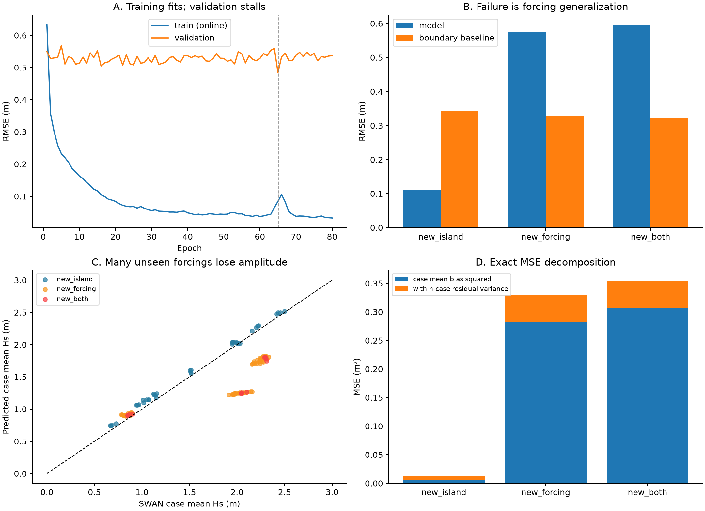
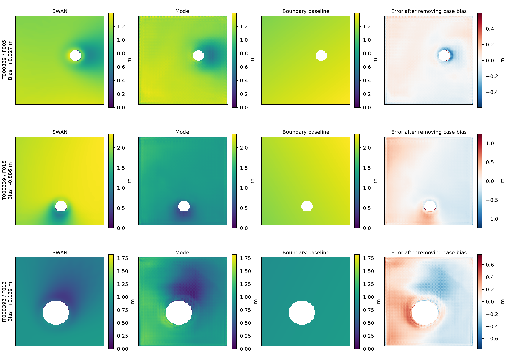

# SWAN 代理模型草稿工程：训练结果深度解读

审计日期：2026-10-09。对象：`D:\BC\Python Learning\Learn` 中现有代码、交付数据和 `toy_runs/hs_unet` 实验。

## 1. 核心判断

**这次实验已经证明：网络能在熟悉海况下学习人工圆岛造成的波场变化；尚未证明：它能在海况改变后稳定预测波高。当前主要失败是海况泛化，表现为部分新海况下整幅波高明显偏低。**

因此，把问题概括为“U-Net 不适合 SWAN”或“再多训几轮就会好”都不符合现有证据。工程管线已经基本连通，但实验中独立海况太少、纯风生浪严重缺失，直接回归绝对 Hs 的模型又没有稳定保留新海况的幅值。前两项有直接证据；具体哪种网络机制导致幅值失效，还需要对照实验。

最重要的发现如下：

| 发现 | 本次证据 | 含义 |
|---|---|---|
| 新岛屿泛化有效 | `new_island` RMSE **0.1096 m**；边界基线 **0.3420 m**；37/37 个 case 优于基线 | 已学到这个人工地形族的一部分空间响应 |
| 新海况泛化失效 | `new_forcing` RMSE **0.5747 m**；基线 **0.3280 m**；仅 2/72 个 case 优于基线 | 主要瓶颈位于海况条件映射 |
| 整体比简单基线差 | 验证 RMSE **0.4842 m**，基线 **0.3317 m**；模型 MSE 为基线 **2.131 倍** | 当前模型不能按整体验证成绩视为合格代理 |
| 独立训练海况非常少 | 227 个训练 case 实际只有 **10 套 forcing** | 大量空间像素与岛屿组合没有带来同等数量的海况信息 |
| 数据缺失具有机制偏向 | 计划 608，交付 474；缺失 **134 个全部是 wind_only** | 当前数据不是完整计划的均衡实现 |
| 波高幅值错误占主导 | 各 case 平均偏差的平方占验证总 MSE **84.8%** | 应优先处理幅值通路与海况覆盖，再处理细节纹理 |
| 未收敛不是当前验证失败的解释 | 训练 227、验证 121 个样本均记录为收敛；4 个未收敛样本全在 test | 不能把验证误差归咎于这 4 个标签 |

本报告区分三类结论：**已确认事实**来自代码与数据复算；**机制解释**是与证据相符但未经干预验证的推断；**后续实验**是建议，不能当作已取得的改进。



## 2. 本次分析依据，以及哪些结论还不能下

主要证据不是 README 中的旧进度描述，而是当前实际交付物：

- [训练数据压缩包](README.md)：直接流式读取，没有解压覆盖工程。
- [训练配置](toy_runs/hs_unet/run_config.json)、[80 轮训练记录](toy_runs/hs_unet/history.csv)、[训练摘要](toy_runs/hs_unet/summary.json)。
- [验证摘要](toy_runs/hs_unet/evaluation/validation/summary.json)、[逐 case 指标](toy_runs/hs_unet/evaluation/validation/metrics_by_case.csv)、121 份已保存验证预测。
- [数据生成代码](../../TOY_SERVER/island_core.py)、[SWAN 输入代码](../../TOY_SERVER/swan_inputs.py)、[数据转换代码](../../TOY_SERVER/prepare_dataset.py)、[训练代码](../../TRAIN_SERVER/train.py)、[评估代码](../../TRAIN_SERVER/evaluate.py)。

本次新增了数据覆盖审计、分海况统计、误差分解和水深分区诊断。具体一致性检查为：

| 检查 | 结果 |
|---|---|
| 压缩包按训练程序同算法计算的完整数据签名 | 与训练记录完全一致：`b9758c251cccbc9989c0d94842794ad4ced2b9ea64f19ebf38b6c5ef3597d69a` |
| 474 份原始 wave/wind 与当前配置和随机种子复算 | 转为 float32 后逐元素一致 |
| 474 份输入特征 x 与重新生成特征对比 | 最大绝对差 `1.1921×10⁻⁷`；mask 无差异；case 身份和划分无差异 |
| 121 份验证预测文件中的 target 与交付 y×5 对比 | 最大差 0；mask 差异 0 |
| 从预测文件重算逐 case RMSE，与原 CSV 对比 | 最大差 0 |

这使得“读错了另一份数据”“单位还原不一致”“报告和预测文件不对应”等解释缺乏支持。

**本次没有重训、没有改动 checkpoint、没有运行 test 推理。** 对 test 只做输入契约、样本覆盖和收敛元数据审计，没有分析其标签场或预测成绩。压缩包不含服务器全部原始 `PRINT`、`run_status.json`，所以不能确定缺失 case 是失败、超时、未执行，还是未转换；也不能全面复核服务器 SWAN 的数值精度。

根目录及训练包 README 中“只有一个本地样本”“尚未正式训练”等表述对应早期验收阶段。当前已有 474 份服务器交付样本及 80 轮训练结果，应按本次实物证据判断进度。旧说明不意味着这些新结果无效。

## 3. 工程实际在学习什么

### 3.1 当前任务是一个受控的稳态 Hs 映射

实际主流程是：

```text
人工圆岛参数 + 人工风浪条件
        ↓ generate_cases.py
SWAN INPUT / bottom.dat / wind.dat / inputs.npz
        ↓ run_swan.py
稳态 SWAN 波场
        ↓ prepare_dataset.py
x(10,128,128) + y(1,128,128) + mask
        ↓ TRAIN_SERVER/train.py
MONAI BasicUNet：输入条件 → Hs 场
```

从函数关系看，模型试图逼近：

\[
\widehat H_s(x,y)=f_\theta\bigl(h(x,y),M(x,y),x,y,
H_{s,b},T_{p,b},\sin\theta_b,\cos\theta_b,u_{10},v_{10}\bigr).
\]

这里的边界波浪和九点风先插值成细网格通道；`M` 是湿点掩膜。其他物理设置固定在 SWAN 配置内，并不作为可变化条件交给网络。

当前实验的范围是：

| 项目 | 实际设置 |
|---|---|
| 空间域 | 一个 0.5°×0.5° 窗口，121×121 原始节点，补零至 128×128 |
| 地形 | 100 m 背景水深、一个圆岛、平滑浅水裙边；32 套几何参数 |
| 岛屿变化 | 半径、位置、裙边宽度、岸侧水深；没有真实岸线复杂度 |
| 风浪条件 | 四类规定海况：无风涌浪、同向风浪、弱风涌浪、纯风生浪 |
| 波谱边界 | 固定 JONSWAP gamma=3.3、方向展宽 30°，输入周期为 Tp |
| 求解 | `MODE STATIONARY TWODIMENSIONAL`；配置含风浪生成、底摩擦与破碎 |
| 神经网络输出 | 只有 Hs；并未训练周期、波向或完整二维波谱 |

`gebco15s` 在这里是**分辨率名称**，数据仍是人工地形。`request_era5.py` 是独立下载入口，当前圆岛生成器不读取其下载结果，也不使用 `sampling.start_utc/end_utc` 生成时间样本。因此，延长 ERA5 下载时间范围不会自动增加本次训练的独立海况。

九点风在文件契约上是完整的九个输入节点，但当前生成器用少量共同参数构造平滑风场，并非九处风速独立随机变化。同理，四角波浪共享背景海况。把它们插值成 121×121，并不会产生新的独立物理情景。

### 3.2 “模仿 SWAN”与“预测真实海洋”是两层目标

本次 RMSE 衡量的是网络相对这套 SWAN 配置的误差。即使该误差很小，也只说明模仿数值模型成功，不能自动证明 SWAN 标签符合真实海况。

真实海域迁移还涉及不规则地形、多岛和岸线、非平稳风浪、流场和水位、边界谱形，以及真实观测验证。当前稳态、固定谱形、单圆岛实验把这些变化冻结，是合理的草稿简化，但报告和模型名称应保留这个范围。

## 4. 数据设计的关键问题：case 数掩盖了海况数量

### 4.1 划分逻辑正确，但独立海况非常稀疏

生成器先划分地形与 forcing，再组合 case。训练原计划为 `24 岛×12 海况=288`。验证和测试各自区分：

- `new_island`：新地形，训练见过的海况。
- `new_forcing`：训练见过的地形，新海况。
- `new_both`：地形与海况都新。

这种设计能揭示具体泛化维度，比把所有 case 打乱随机切分更适合当前问题。当前实物核查未发现这些分组与其含义不符。

但是，原计划每个物理类别只有 **3 套独立训练海况**，每个验证类别只有 **1 套新海况**。实际训练还只剩 10 套 forcing：9 套非纯风生浪全部保留，纯风生浪只保留 F008 的部分岛屿组合。

同一 forcing 被放在 24 个岛上，能增加地形响应信息；它仍然只是一个风速、周期、波向、波高组合。320 万训练湿点也不能被视为 320 万个独立海况样本。

### 4.2 实际样本缺失高度集中

| 划分 | 组别 | 计划 | 实际 | 缺失 |
|---|---|---:|---:|---:|
| train | 已见岛屿、已见海况 | 288 | 227 | 61 |
| validation | new_island | 48 | 37 | 11 |
| validation | new_forcing | 96 | 72 | 24 |
| validation | new_both | 16 | 12 | 4 |
| test | new_island | 48 | 38 | 10 |
| test | new_forcing | 96 | 72 | 24 |
| test | new_both | 16 | 16 | 0 |
| 合计 | — | **608** | **474** | **134** |

**134 个缺失全部属于纯风生浪。** 其他三类海况计划内的 456 个 case 全部存在。

| 纯风生浪 forcing | 所属海况划分 | 计划组合数 | 实际组合数 | 缺失数 |
|---|---|---:|---:|---:|
| F004 | train forcing | 32 | 0 | 32 |
| F008 | train forcing | 32 | 14 | 18 |
| F012 | train forcing | 32 | 0 | 32 |
| F016 | validation forcing | 28 | 0 | 28 |
| F020 | test forcing | 28 | 4 | 24 |

上表按 forcing 身份统计，因此 train forcing 的组合也包含验证和测试中的新岛屿。

后果很具体：训练集纯风生浪只剩 **11/227**；验证集只剩 **1/121**，而且该例仍是训练见过的 F008。**此次验证完全没有检验新的纯风生浪 forcing。** 原本想验证的四类物理机制，在交付后变成了不完整任务。

这证明数据覆盖有问题，却不能直接证明它造成了 F014/F015 的误差。F014/F015 所属的非纯风生浪类没有缺失；它们的问题更直接地指向每类只有三套训练海况及模型的条件泛化。修复 wind_only 缺失有必要，但不能承诺补齐后现有三类验证误差就会消失。

缺失详情见 [forcing 覆盖表](reports/swan_surrogate_review/forcing_coverage.csv) 和 [计划—实物逐例核对表](reports/swan_surrogate_review/planned_vs_actual_cases.csv)。缺失原因必须回到服务器原始运行状态核查，不能从这个训练压缩包反推。

### 4.3 “总体覆盖全方向”不等于每类海况都有方向覆盖

当前代码对一个 split 的总体方向做分层抽样，再把不同方向分配给四类海况。因此，全部训练 forcing 看似覆盖圆周，各类别实际上只有三个方向。

以验证中最差的弱风涌浪 F015 为例：

| forcing | 用途 | 平均边界 Hs / m | 平均 Tp / s | 波浪 FROM / ° | 平均风速 / m·s⁻¹ | 风与浪来向差 |
|---|---|---:|---:|---:|---:|---:|
| F003 | 训练 | 1.119 | 9.594 | 253.61 | 3.020 | +90° |
| F007 | 训练 | 0.806 | 13.230 | 237.86 | 1.996 | −45° |
| F011 | 训练 | 2.350 | 9.573 | 102.71 | 3.002 | +90° |
| **F015** | **验证** | **2.116** | **10.438** | **10.78** | **1.787** | **0°** |

F015 的 Hs、Tp 分别落在同类训练极值范围内，但其方向距最近的同类训练方向仍约 92°；风速低于同类训练均值最小值，风浪相对方向也是该类训练未见的组合。这是明显的**联合条件覆盖不足**，不能因为某一个输入变量没有超范围就把它称为充分采样下的简单插值。

F013 的平均边界 Hs 为 0.954 m，低于无风涌浪训练组的最低平均 Hs 1.257 m，具有同类别幅值外推。F014 的多数主要标量位于同类训练范围内，仍发生大误差，说明问题也不只来自极值越界。

建议后续明确区分：同类别范围内插值、未见变量组合、范围外外推。当前一次随机抽样把这些难度混合在“new_forcing”中。

## 5. 训练曲线：优化成功，泛化没有跟上

模型为 MONAI BasicUNet，497,201 个参数，特征宽度 `(16,16,32,64,128,16)`，GroupNorm 四组，无 dropout；AdamW，学习率 `3e-4`，batch size 8，80 轮，单个训练随机种子。当前代码没有学习率调度或早停。

损失是有效湿点的归一化 Hs MSE：

\[
L=\frac{\sum M(\widehat H_s/5-H_s/5)^2}{\sum M},\qquad
\mathrm{RMSE}_{m}=5\sqrt L.
\]

所以日志中 `loss≈0.01` 对应约 0.5 m 的 RMSE，并不意味着物理误差很小。

| Epoch | 训练日志换算 RMSE / m | 验证 RMSE / m |
|---:|---:|---:|
| 1 | 0.6333 | 0.5492 |
| 16 | 0.1048 | 0.5045 |
| 60 | 0.0374 | 0.5278 |
| **65，保存的 best** | **0.0846** | **0.4840** |
| 80 | 0.0328 | 0.5365 |

注意：训练列是一轮内各 batch 更新前损失的汇总换算，不是固定 epoch 80 权重在训练集上重新评估所得的精确 RMSE。尽管如此，训练持续改善而验证停滞的趋势非常明确。

这说明网络已有充分能力拟合当前训练样本。继续增加 epoch 主要降低训练误差，没有带来持续的验证改善。**80 轮中没有一轮整体验证 RMSE 超过边界插值基线。** 因此，单独做早停也不足以解决问题。

epoch 65 是一次孤立的验证低点，次好为 epoch 16。它作为当前规则选出的 best 是合法的，但只有单个种子的轨迹，不能据此认为该轮代表稳定、可重复的泛化水平。也不能仅凭局部波动认定学习率过高。

## 6. 误差到底在哪里

### 6.1 整体指标只能描述结果，分组指标才能解释结果

这里的基线是把四角边界 Hs 双线性插值到细网格，即输入 `wave_hs` 通道还原成米。它没有计算地形遮蔽、风生增长或折射，是一个很有价值的最低参照。

| 验证组 | case 数 | 模型 RMSE / m | 基线 RMSE / m | 模型 Bias / m | 模型 R² | MSE skill |
|---|---:|---:|---:|---:|---:|---:|
| 全部 | 121 | 0.4842 | 0.3317 | −0.2566 | 0.4545 | −1.1311 |
| 新岛屿 | 37 | 0.1096 | 0.3420 | +0.0691 | 0.9687 | +0.8974 |
| 新海况 | 72 | 0.5747 | 0.3280 | −0.3980 | 0.2525 | −2.0695 |
| 两者都新 | 12 | 0.5956 | 0.3207 | −0.4257 | 0.1952 | −2.4493 |

\[
\mathrm{skill}=1-\frac{\mathrm{MSE}_{model}}{\mathrm{MSE}_{baseline}}.
\]

总体 skill 为 −1.1311，表示模型 MSE 比基线高 113.1%；对应 RMSE 高约 46.0%，这两个百分数不能混用。

新岛屿组的优势不是只靠一两个样本：37 个 case 全部优于基线。新海况组仅 2 个优于基线，两者皆新组没有。这支持“熟悉海况下的空间响应已经学到一部分”的判断；其范围仍局限于同一人工圆岛分布。

### 6.2 两套新海况贡献了 93.9% 的总平方误差

以下统计合并了同一新 forcing 在旧岛、新岛上的验证样本，每个 forcing 各 28 个 case。RMSE 由有效像素 SSE 汇总计算，不是逐 case RMSE 的简单平均。

| 新 forcing | 类别 | 模型 RMSE / m | 基线 RMSE / m | Bias / m | 对全部验证 SSE 的贡献 |
|---|---|---:|---:|---:|---:|
| F013 | 无风涌浪 | 0.2150 | 0.1726 | +0.0634 | 4.54% |
| **F014** | **同向风浪** | **0.5497** | **0.4527** | **−0.4908** | **29.69%** |
| **F015** | **弱风涌浪** | **0.8082** | **0.2933** | **−0.7787** | **64.18%** |
| 其余已见 forcing | 新岛屿组合 | — | — | — | 1.58% |

F015 单独占验证总平方误差的约三分之二。该组 SWAN 平均 Hs 为 **2.0268 m**，模型仅 **1.2481 m**，低估约 **38.4%**。F014 则从 **2.2530 m** 预测为 **1.7622 m**，低估约 **21.8%**。

所以“整体平均低估 15.5%”还不够准确：它把已见海况的轻微高估、F013 的轻微高估、F014/F015 的大幅低估混在了一起。统一加一个全局常数不可能同时修复这些不同情况。

逐海况结果见 [validation_metrics_by_forcing.csv](reports/swan_surrogate_review/validation_metrics_by_forcing.csv)。

### 6.3 精确分解：平均波高偏差与空间结构误差

对 case \(i\) 的湿点残差定义 \(e_i=\widehat H_i-H_i\)，其空间均值为 \(b_i\)。有恒等式：

\[
\mathrm{MSE}_i=b_i^2+\operatorname{mean}\bigl[(e_i-b_i)^2\bigr].
\]

再按各 case 湿点数加权，就能把原始整体验证 MSE 精确拆成两项。

| 组别 | case 平均偏差平方占该组 MSE | 去掉各 case 平均偏差后的残差 RMSE / m |
|---|---:|---:|
| 全部 | **84.79%** | 0.1888 |
| new_island | 47.70% | 0.0792 |
| new_forcing | 85.20% | 0.2211 |
| new_both | 86.46% | 0.2192 |
| F013 | 10.06% | 0.2039 |
| F014 | 80.04% | 0.2456 |
| F015 | **93.20%** | 0.2108 |

**右列是借助真实标签计算的诊断分解，不能作为校准后可部署的模型成绩。** 它不是一次成功改模，也不能在推理时凭空获得每个 case 的真实均值。

这个分解说明，F015 首要问题是整幅幅值，不仅是岛边几条格点预测不准。但空间问题仍存在：新岛屿组单 case 空间相关系数中位数为 **0.960**，新海况组只有 **0.708**；F014 为 **0.470**。因此也不能说“只需校准一个波高尺度，空间形状已经完全正确”。

全局减掉一个平均偏差后，残差 RMSE 仍为 **0.4107 m**；这与逐 case 去偏差后的 0.1888 m 差别很大，进一步说明偏差随海况变化。



图中使用原评估选出的较好、最差和中位 case。最差的 IT000339/F015 存在大范围低估，去掉其平均偏差后仍有空间残差。图的最后一列用于定位结构错误，不代表可用标签修正预测。

### 6.4 大面积深水背景主导损失，近岛能力要单独考核

验证集湿点中，水深 ≥80 m 占 **88.6%**，水深 <20 m 仅占 **2.6%**。原损失按湿点等权平均，因此近岸少量格点对总损失的影响有限。

| 水深区间 | 湿点数 | 模型 RMSE / m | 基线 RMSE / m |
|---|---:|---:|---:|
| <20 m | 45,029 | 0.4812 | 0.5688 |
| 20–80 m | 150,518 | 0.4646 | 0.4621 |
| ≥80 m | 1,523,935 | 0.4862 | 0.3058 |

这里有两个同时成立的结论：模型在全部验证浅水点汇总上仍有相对基线的增益；整体验证失败则包含广泛的深水背景幅值错误。不能只用全域 RMSE 否定所有近岛学习，也不能只挑浅水优势宣称整体已成功。

对于新岛屿组，<20 m 的 RMSE 为 **0.2198 m**，明显高于该组全域 0.1096 m。即使是成功组，岸侧细节仍有改进空间。

外缘 5 个节点带的 RMSE 为 **0.4817 m**，去掉该带的内部区域为 **0.4847 m**。边缘纹理值得检查，但错误并没有集中到边缘，不支持把 padding 当作当前整体失效的首要原因。水深分区也不等于背浪区划分，真正的岛后遮蔽评估还需结合方向与地形定义区域。

## 7. 根因排序：哪些确定，哪些只是候选解释

### 7.1 第一优先级：海况条件样本稀疏，泛化证据不足

这是最有力的解释。训练仅有 10 套独立 forcing，每个非纯风生浪类别只有 3 套；F015 又改变了多个条件的组合。网络可以通过有限海况特征学到某些稳定空间模式，却未必获得连续、可靠的海况响应。

新岛屿组好、新海况组差，与这个解释相符。但“网络究竟记住了哪一种模板”没有直接测量，不能把模板记忆写成已证实的内部机制。

### 7.2 第二优先级：直接 Hs 回归缺少明确的幅值保留路径

输入已经包含强基线 \(B(x,y)\)：四角 Hs 的插值。当前网络直接输出绝对 Hs，需要同时学习背景幅值和地形、风的修正。

建议优先对照：

\[
\widehat H_s=B+\Delta_\theta(X).
\]

如果残差头初始化为零，初始输出就是基线；后续学习修正。它仍不保证最终优于基线，必须验证。但其设计与“84.8% 的误差来自 case 幅值偏差”这一诊断更直接相关，比立即更换大型架构更有针对性。

纯风生浪时 \(B=0\)，残差分支必须能自行产生正波高，因此不要采用只能乘以边界 Hs 的形式 \(\widehat H_s=B\times g_\theta\)：那会把零边界下的全部预测锁成零。

另一组对照是把原始 Hs、周期、风等条件经过独立分支注入解码器，使幅值不必完全依赖卷积归一化后的隐层表达。这些都是待验证方案。

### 7.3 GroupNorm 是合理的消融对象，尚不是已证实的罪因

当前模型显式使用 GroupNorm。它按每个样本内部的通道组和空间位置计算均值、方差，训练与评估都用当前输入统计，不存在 BatchNorm 那种运行均值切换问题。[PyTorch GroupNorm 官方说明](https://docs.pytorch.org/docs/stable/generated/torch.nn.modules.normalization.GroupNorm.html)

从标准化公式可以推断：如果海况强弱主要体现为某组隐特征的共同缩放或平移，归一化可能减弱这种绝对幅值线索。但当前输入混合了水深、坐标、方向、风浪等通道，改变 Hs 并不等价于所有隐特征共同缩放。所以不能直接断言“GroupNorm 把 Hs 全部归一化没了”。

应在同一数据、同一划分上分别训练：现有 GN、无 GN、GN 加独立条件分支。不能在已训练模型的推理阶段临时关闭 GN，然后把结果当作无 GN 模型的公平比较。

### 7.4 像素 MSE、尺度与上采样是次级因素

像素 MSE 更关注大面积海域和绝对误差大的区域；没有专门约束近岸、波影、梯度或局部峰值。可在幅值泛化改善后比较分水深权重、case/forcing 等权损失及适量空间梯度约束。

现有图中能看到边缘和细密纹理，值得对比插值上采样与当前 BasicUNet 默认的反卷积。默认结构可核对 [MONAI 1.5.2 源码](https://github.com/Project-MONAI/MONAI/blob/1.5.2/monai/networks/nets/basic_unet.py)。但现有证据无法把纹理唯一归因于反卷积，更不能认为这解释了全域幅值偏差。

模型缩窄、学习率衰减、weight decay 调整也可以列入后续控制实验。它们不能替代独立海况覆盖；目前没有理由先把网络换成更大模型。

## 8. 不应被误诊为当前主因的问题

| 常见怀疑 | 本次核查后的判断 |
|---|---|
| Hs 单位或归一化错了 | 未发现；训练/评估均按 5 m 尺度还原，保存标签与数据包一致 |
| 陆地和 padding 混入损失 | 未发现；mask 明确排除，数组检查通过 |
| 忘记切换 eval 模式 | 未发现；训练验证和独立评估均正确切换 |
| 用错 checkpoint 对应的数据 | 未发现；评估核对数据签名、模型设置、通道和归一化，且本次独立复算签名一致 |
| AMP 导致巨大误差 | 不支持；best 的训练内验证 RMSE 0.483982，独立 FP32 为 0.484239，相差约 0.000257 m |
| 负波高是主要问题 | 不支持；负值只占 0.0776%；截断到 0 后 RMSE 仅从 0.484239 变为 0.484132 m |
| 4 个未收敛标签污染训练 | 不成立；这 4 个样本全部在 test，训练和验证均为收敛记录 |
| 全局方向或空间转置颠倒 | 没有支持证据；全部特征复算一致，本地已完成 SWAN 一例的风向、地形和标签链也一致 |
| epoch 太少 | 与趋势不符；训练误差很低，验证长期停滞 |

这些核查不能替代所有数值物理检查。尤其“特征复算一致”只能说明与当前生成逻辑一致，不会自动证明生成逻辑的所有物理假设正确。

## 9. SWAN 标签与未来真实海况接口的限制

### 9.1 收敛记录不等于数值解已具有足够物理精度

数据集中 470 个样本记录为收敛，4 个为未收敛；后者全部是 test/new_both/F020，运行到 50 次迭代，合格湿点比例分别为 95.58%、95.32%、97.09%、95.51%。当前策略是 `record_only`，保留输出并记录状态。

“99.5% 湿点满足迭代停止判据”不是“结果有 99.5% 物理准确率”。收敛还应结合增加迭代、收紧阈值后的波场差异来判断。[SWAN NUMERIC 官方说明](https://swanmodel.sourceforge.io/online_doc/swanuse/node29.html)

建议选择少量无风涌浪、同向风浪、弱风涌浪、纯风生浪及浅水高梯度 case 做标签稳定性实验，比较数值设置变化引起的 Hs 差异与期望代理误差。它用于评估标签可信度，不应把现有验证失败一概转移给 SWAN。

### 9.2 四边边界不应被硬约束为给定总 Hs

SWAN 使用边界谱的入射分量，出射分量由内部解决定。因此边界输出的总 Hs 可以不同于用户提供的全谱参数；四边共享同一背景谱也不是四边各自独立向域内注入完整波高。[SWAN 边界条件说明](https://swanmodel.sourceforge.io/online_doc/swanuse/node11.html)

残差基线可以使用边界 Hs 插值，但不能据此把全周预测总 Hs 硬钉为输入 Hs。若加入物理边界损失，应考虑入射方向与谱，而非把 bulk 标量误作处处严格成立的 Dirichlet 条件。

### 9.3 物理范围与谱分辨率需要写清

当前配置没有显式 `DIFFRAC`，不能把岛后的所有波高变化都称作已验证的绕射；遮蔽、方向展宽和折射等也会影响该区域。模型学习的是当前数值设置输出。

36 个方向对应 10° 间隔。官方手册给出的典型方向分辨率建议对风浪和涌浪不同；当前所有类别又固定了 30° 展宽。因此应做谱分辨率敏感性检查，不能仅因为类别名是“涌浪”就判定 10° 必然错误。[SWAN 网格说明](https://swanmodel.sourceforge.io/online_doc/swanuse/node11.html)

### 9.4 真实海况的输入可能不足以唯一决定响应

当前固定单峰谱形时，Hs、Tp、平均方向能够定义受限制的边界条件族。进入真实混合海况后，不同频率—方向分布可能具有相同的少数 bulk 指标，而地形作用后的波场仍不同。仅靠四角三个标量的输入契约，不能自动保留双峰谱、风浪与涌浪分量等信息。

因此，现有草稿应先做到“在固定谱族内可泛化”，再比较更丰富的谱描述或谱边界输入。这个可辨识性限制是未来真实任务的问题，不是本次固定谱族内表现差的替代解释。

ERA5 下载链还有明确的周期语义：当前独立下载配置为 `period=mean`，项目映射为 mp1/Tm01；mwp/Tm−1,0 同时保留；本次圆岛则使用 Tp/PEAK。这些字段不能仅因都以秒为单位就直接互换。见 [周期映射](../../TOY_SERVER/project.py) 和 [下载配置](../../TOY_SERVER/era5_config.json)。

## 10. 当前评估还应怎样解读

### 10.1 验证集中 121 个 case，不等于 121 个新海况

72 个 `new_forcing` 实际是 3 套新海况×24 个已见岛屿。把 case 作为独立单位 bootstrap，比把空间像素视为独立样本更合理，但仍没有处理共享 forcing 引起的相关性。

原报告的置信区间主要描述当前 case 集合的重采样变化，不能解释为对任意新海况的可靠置信区间。仅有 3 个新 forcing 时，把 bootstrap 重复次数从 2,000 提高到更多次，也不会增加海况信息。

建议同时报告逐 forcing 指标、forcing 等权宏平均，并使用按 forcing 分块或地形—海况交叉分组的统计。最根本的改进是增加独立验证 forcing。

### 10.2 总体相关系数与空间相关不是同一个问题

汇总 R² 和 Pearson r 把不同 case 的像素放在一起，既包含不同海况之间的均值变化，也包含每张图内部的空间变化。高汇总相关不自动等于岛后空间细节准确。

当前新岛屿组汇总 R² 为 0.9687，其单 case 空间相关中位数约 0.960，两种证据共同支持该组表现好。F014 的单 case 空间相关中位数只有 0.470，则提醒我们幅值修正以外仍有结构问题。

### 10.3 基线和选模准则应与用途一致

边界 Hs 基线适合检验“复杂模型是否超越已知输入背景”。但纯风生浪边界为零，基线也恒为零，击败它并不充分证明学会了风生增长。该类还应加入依赖风速、方向和有效 fetch 的简单经验基线，或由训练数据拟合的低维基线。

现有 best 按整体验证湿点 MSE 选择，合理但只对应这一目标。如果重点是新海况、近岸或三类泛化均衡表现，应预先固定相应指标，保留总体指标作为约束，避免看完结果后只选择有利分组。

当前 `quality_gates` 全为 null。评估程序顺利结束只能证明流程完成，不代表通过模型性能验收。

## 11. 推荐的下一轮实验顺序

### 11.1 P0：先把数据交付与任务范围补齐

1. 从服务器导出全部 608 个 case 的运行状态、耗时、失败原因、收敛比例和输入配置，按 forcing/family 汇总。首先解释 134 个纯风生浪缺失，区分未执行、超时、失败、未转换。
2. 针对纯风生浪做少量数值复算，依据实际日志决定迭代、时限和初始化设置；不能只放宽“通过”条件。
3. 生成有明确版本的新数据集，保存全部计划、成功、失败和缺失清单。若将样本排除，明确相应适用范围；不要把四类完整任务与三类为主的交付混称。
4. 保留当前实验作为基准，避免覆盖其数据、权重和指标。

完成标志：数据规模与排除原因可解释，训练和验证各物理类别都有独立海况，未收敛标签有单独质量报告。

### 11.2 P1：增加独立 forcing，优先减少重复组合的浪费

增加样本时，优先增加海况数量，而不是继续把相同 10 套海况配到更多相似圆岛。

一个用于规划的预算例子：原本 24 岛×12 forcing 需要 288 次训练 SWAN；可以改为 48 套 forcing、每套配 6 个均衡选择的岛，同样是 288 次。仍保留 24 个岛，并使各岛出现频率均衡，配对图保持连接；必要时用少量共同锚点作完整交叉对照。这是设计例子，不代表 48 套已被证明足够。

采样要在**每个海况类别内部**分层覆盖方向、幅值、周期和风浪夹角，并保留物理耦合约束。先明确插值和外推两套验证任务。当前每类一个新 forcing 太少，可先以每类多个独立验证 forcing 为最低改进，再按预算扩大。

不要为追求“独立输入”随意造出不协调的 Hs/Tp/U 组合。也不能改变 forcing 后沿用旧 SWAN 标签。

### 11.3 P2：用最少的模型对照定位幅值问题

| 编号 | 控制实验 | 固定条件 | 主要回答的问题 |
|---|---|---|---|
| A | 现有直接 Hs 回归 | 原数据、原划分，增加训练种子 | 当前失败是否稳定复现？ |
| B | 边界插值 + 零初始化残差头 | 与 A 相同数据、训练预算 | 显式保留背景幅值是否改善新海况？ |
| C | 直接 Hs 回归，去掉 GN | 其余尽量一致；记录优化稳定性 | GN 是否参与幅值泛化失效？ |
| D | GN + 原始海况条件分支 | 与 A 相同数据 | 保留条件幅值是否比移除归一化更有效？ |
| E | 用扩充后的独立 forcing 重复 A/B | 模型设置不变 | 覆盖不足与结构偏置各贡献多少？ |

每个候选建议至少 3 个训练随机种子，先比较分 forcing 的 RMSE、Bias、基线 skill、case 内空间残差。预算有限时优先 A/B/E，再做 C/D。不能一次同时换数据、架构、损失与采样，然后声称已定位某个原因。

可加一个低成本诊断：在训练中留出部分“已见地形×已见 forcing 的未见组合”，检验模型是否能做组合泛化。它仅是训练设计内的辅助诊断，不能替代真正的 held-out forcing 验证。

### 11.4 P3：幅值问题改善后再加强近岸和空间结构

统一报告全域、<20 m、20–80 m、深水背景、迎浪/背浪区的指标；对比浅水权重或梯度损失，以及插值上采样。保持原始全域成绩可见，避免用一个区域的改善掩盖另一个区域的退化。

几何增强必须同步变换地形、目标、mask、风矢量、波向和边界矩阵。当前球面经纬网格的物理尺度也不严格支持任意 90° 图像旋转，因此不宜直接套用医学图像的增强配方。

### 11.5 P4：预先确定通过条件，再使用测试集

建议这份草稿的首个里程碑为：各主要泛化组相对合理基线有稳定正 skill；F014/F015 式整幅幅值崩塌显著减少；新的纯风生浪能被独立验证；多种子和多个 held-out forcing 的结论一致。

绝对 RMSE 门槛应由用途确定，本次不凭空指定“必须 0.1 m”。模型、阈值和预处理固定后再评估 test。测试中的 4 个未收敛样本应按预先规定的策略单列报告或复算，不能在看到测试误差后临时决定是否剔除。

## 12. 这份草稿目前能支持的结论

当前工程实现了可追溯的数据生成、SWAN 运行、训练和评估链。已有结果支持在固定谱族、稳态、单圆岛地形范围内，网络能够学习熟悉海况下的空间响应。

现有实验不支持跨海况可靠代理，更不支持直接迁移真实复杂海域。下一轮最有价值的工作是：**补齐物理类别的交付证据，增加独立海况覆盖，用残差与条件分支实验检验幅值通路，然后再优化近岸细节。** 这比单纯延长训练或更换更大网络更符合已观察到的误差结构。

## 附录 A：审计产物与复现

| 文件 | 内容 |
|---|---|
| [audit_dataset.py](reports/swan_surrogate_review/audit_dataset.py) | 压缩包签名、计划与实物覆盖、forcing 特征、分海况指标 |
| [prediction_diagnostics.py](reports/swan_surrogate_review/prediction_diagnostics.py) | 验证预测一致性、MSE 分解、水深区域统计、图表 |
| [dataset_audit.json](reports/swan_surrogate_review/dataset_audit.json) | 数据审计完整机器可读结果 |
| [prediction_diagnostics.json](reports/swan_surrogate_review/prediction_diagnostics.json) | 预测诊断完整机器可读结果 |
| [case_diagnostics.csv](reports/swan_surrogate_review/case_diagnostics.csv) | 每个验证 case 的均值偏差、空间误差和相关性 |
| [region_diagnostics.csv](reports/swan_surrogate_review/region_diagnostics.csv) | 各组、各 forcing 的水深与边缘区域统计 |
| [quantitative_audit_notes.md](reports/swan_surrogate_review/quantitative_audit_notes.md) | 完整样本覆盖、20 套 forcing 和分组数值表 |
| [training_audit_notes.md](reports/swan_surrogate_review/training_audit_notes.md) | 训练实现审计、源码行号与对照设计 |
| [physics_data_audit_notes.md](reports/swan_surrogate_review/physics_data_audit_notes.md) | 物理配置、边界语义、本地一例输入输出核验 |

在工程根目录、已激活可用 Python 环境的 PowerShell 中复现：

```powershell
python reports/swan_surrogate_review/audit_dataset.py
python reports/swan_surrogate_review/prediction_diagnostics.py
```

需要 NumPy、Pandas 和 Matplotlib；审计脚本从工程现有代码导入生成器。脚本只将分析产物写入 `reports/swan_surrogate_review/`，不训练、不请求 ERA5、不运行 SWAN、不修改原数据和权重。图表中的去偏差结果均为使用标签的诊断量，不能作为独立模型的性能宣称。

## 附录 B：核心源码定位

| 位置 | 本报告依赖的事实 |
|---|---|
| [island_core.py](../../TOY_SERVER/island_core.py)，`generate_forcings` / `case_plan` | 海况类别、独立 forcing 数、方向采样、因子划分 |
| [forcing_arrays.py](../../TOY_SERVER/forcing_arrays.py)，`model_inputs` | 十通道含义、log 深度、方向 sin/cos、输入尺度 |
| [swan_inputs.py](../../TOY_SERVER/swan_inputs.py)，`render_input` / `boundary_blocks` | 稳态、NAUTICAL、PEAK、谱网格和四边边界 |
| [prepare_dataset.py](../../TOY_SERVER/prepare_dataset.py)，第 41–94 行附近 | 已完成结果转换、Hs 标签、mask、元数据与收敛记录 |
| [train.py](../../TRAIN_SERVER/train.py)，第 46–75、145、180–202 行附近 | 损失定义、训练/验证模式、优化器和选模 |
| [model_factory.py](../../TRAIN_SERVER/model_factory.py)，第 4–14 行 | MONAI BasicUNet、GroupNorm、无 dropout |
| [training_core.py](../../TRAIN_SERVER/training_core.py)，`validate_dataset` | 数据契约、划分检查、内容签名 |
| [evaluate.py](../../TRAIN_SERVER/evaluate.py)，第 49–128、336–351、394–431 行附近 | 指标、bootstrap、checkpoint 合同、基线和预测保存 |

行号对应本次审计时的文件版本；函数名是后续代码变化时更稳定的检索入口。
